# R-Project 3: Diamond Price Analysis, Regression Modeling & ANOVA (R)

This project analyzes a **diamond price dataset (53,940 rows, 10 features)** from Kaggle to understand **price determinants**, evaluate how **carat and dimensions** influence price, and test whether **cut, color, and clarity** significantly affect mean price.  
The analysis uses **correlation**, **linear regression**, and **ANOVA** to uncover meaningful trends in diamond valuation.

* **Dataset:** Kaggle Diamond Prices (53,940 rows × 10 variables)  
* **Tools:** R, tidyverse, ggplot2, corrplot, caret, psych  
* **Techniques:** EDA, histograms, barplots, boxplots, correlation analysis, linear regression, ANOVA, Tukey post-hoc tests  
* **Goal:** Identify the strongest predictors of diamond price and evaluate statistical significance across categorical groups.

---

### 📁 Dataset Overview

The dataset contains:

- **price** — USD price  
- **carat** — weight  
- **cut** — Fair → Ideal  
- **color** — D → J  
- **clarity** — I1 → IF  
- **depth, table** — proportions  
- **x, y, z** — measurements in mm

  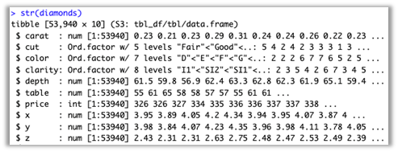
  
<em>Dataset structure overview.</em>

---

### 🧹 Data Cleaning

The dataset contains **no missing values** (verified in R).  
All variables were typed correctly (numeric vs categorical), so no transformation was required.

---

### 🔗 Correlation Analysis

We selected 7 numerical features:

- price, carat, depth, table, x, y, z

Results from the correlation matrix :contentReference[oaicite:1]{index=1}:

- **carat ↔ price** → **0.92**, strongest relationship  
- **x, y, z ↔ price** → strong positive (0.86–0.88)  
- **table ↔ price** → weak positive (0.18)  
- **depth ↔ price** → near zero correlation (–0.01)

  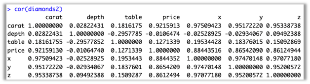

  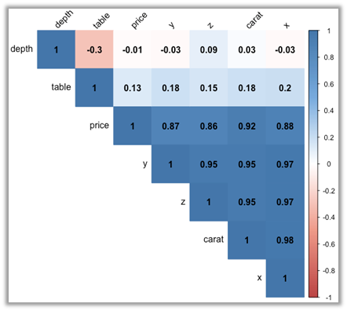

---

### 📈 Histograms

#### Price (right-skewed)

  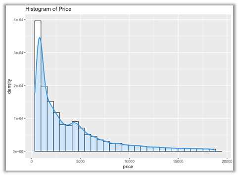

#### Carat (right-skewed)

  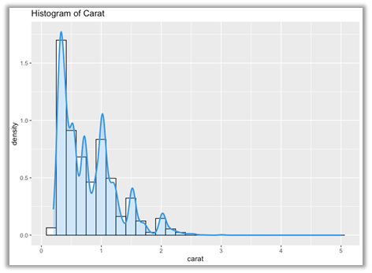

#### Depth (approximately normal)

  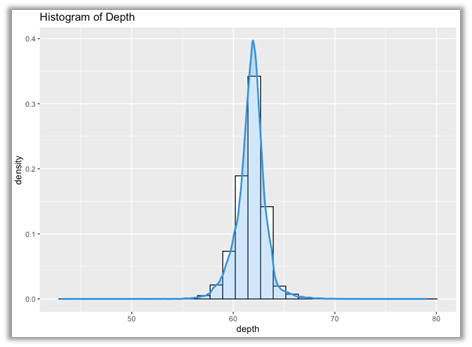

#### Table (majority between 55–60)

  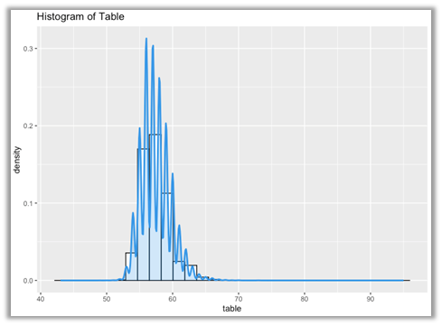

---

### 📦 Bar Plots (Categorical Distributions)

#### Cut  
Most diamonds are **Ideal**, followed by Premium and Very Good.

  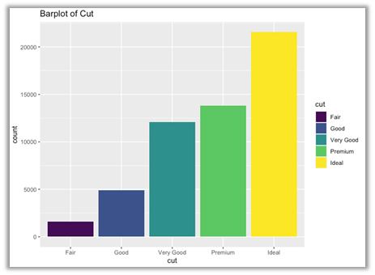

#### Color  
Most common colors: **G, E, F, H**

  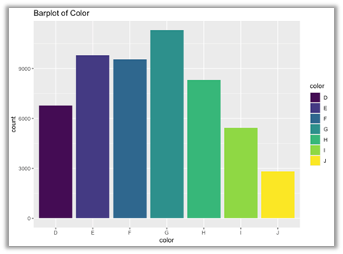

#### Clarity  
Top categories: **SI1 → VS2 → SI2**

  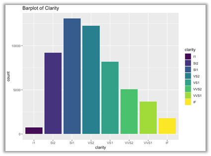

---

### 📦 Boxplots (Price vs Categories)

#### Price vs Cut

  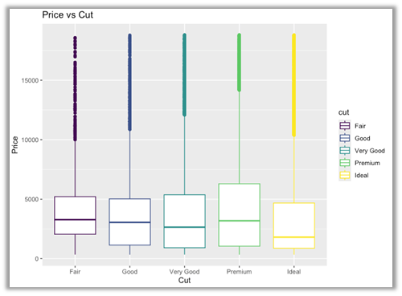

#### Price vs Color

  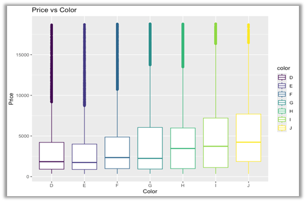

#### Price vs Clarity

  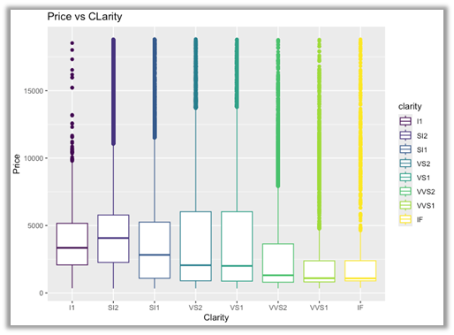

---

### 📉 Scatterplots (Price vs Physical Dimensions)

Six scatterplots were produced:  
- Price vs x (length)  
- Price vs y (width)  
- Price vs z (depth)  
- Price vs depth %  
- Price vs table  
- **Price vs carat** (strongest relationship)

  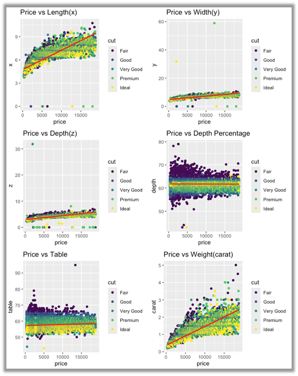
  
<em>Scatterplots showing relationships between price and physical dimensions.</em>

---

### ❓ Questions & Methods

#### 1️⃣ Which factors have the most impact on diamond prices?
Correlation analysis showed:  
- **Carat** → strongest predictor  
- **x, y, z dimensions** → strong predictors  
- **Table** → weak effect  
- **Depth** → negligible effect

#### 2️⃣ Can price be predicted using carat weight?
Three linear regression models were tested:

| Model | Predictors | Adjusted R² | Notes |
|-------|------------|--------------|-------|
| Model 1 | carat + table + depth | **0.8547** | Best model |
| Model 2 | carat + table | 0.852 | Strong |
| Model 3 | carat + depth | 0.8517 | Strong |

  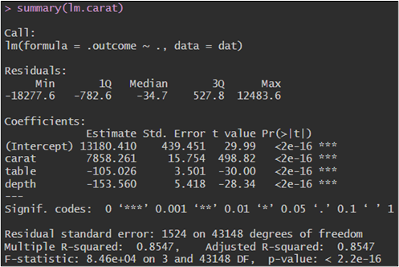

  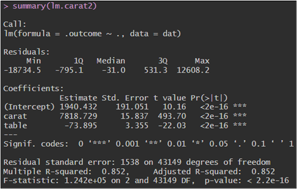

  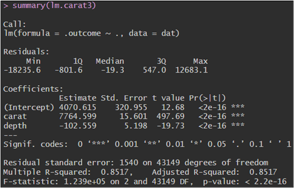

Cross-validation RMSEs were nearly identical → **no overfitting**.

  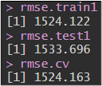

#### 3️⃣ Do cut, color, or clarity significantly impact prices?
One-way ANOVA was applied:

  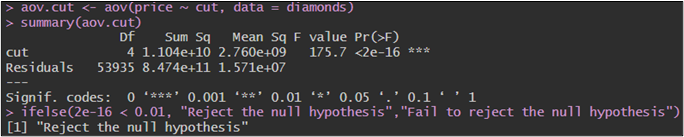
  
<em>Summary of ANOVA (price ~ cut)</em>

  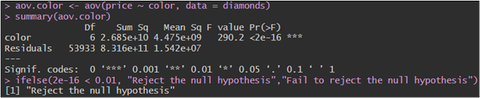
  
<em>Summary of ANOVA (price ~ color)</em>

  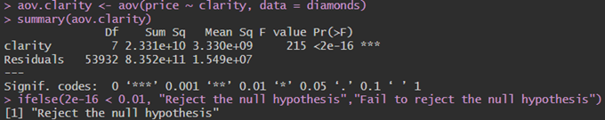
  
<em>Summary of ANOVA (price ~ clarity)</em>

- **cut → price** → significant (p < 2e-16)  
- **color → price** → significant (p < 2e-16)  
- **clarity → price** → significant (p < 2e-16)

Tukey post-hoc analysis identified which groups differ:

  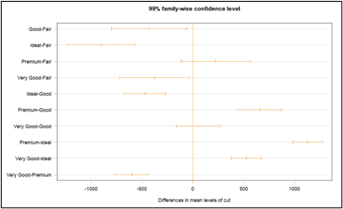
  
<em>Tukey test for Cut</em>

- **Statistically Significant**: Premium - Ideal,  Ideal - Fair, Very Good - Premium, etc.
- **Not Statistically Significant**: Very Good - Good, Premium – Fair

  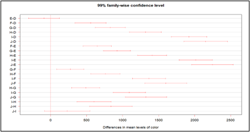
  
<em>Tukey test for Color</em>

-**Statistically Significant**: J - E, J - D, I - E, etc.
-**Not Statistically Significant**: E - D, J - I

  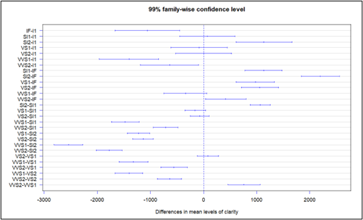
  
<em>Tukey test for Clarity</em>

-**Statistically Significant**: VVS1 - SI2, SI2 - IF, VVS2 - SI2, etc.
-**Not Statistically Significant**: VS2 - I1, SI1 - I1, VS1 - I1, etc.

---

### 🧠 Key Insights

- **Carat weight** is the strongest driver of price  
- Dimensions (x, y, z) also strongly impact price  
- Depth % and table % have little predictive value  
- High-quality diamonds (Ideal cut, D/E colors, VVS/IF clarity) are significantly more expensive  
- Regression models with carat + table + depth predict price **very accurately**  
- ANOVA confirms price differs significantly across cut, color, and clarity groups  

---

### 🧠 Skills Demonstrated

- R-based data cleaning & feature exploration  
- ggplot2 visual analytics (histograms, barplots, boxplots)  
- Correlation & scatterplot analysis  
- Linear regression modeling with K-fold CV  
- ANOVA & Tukey post-hoc comparisons  
- Interpretation of statistical results for real pricing insights  

